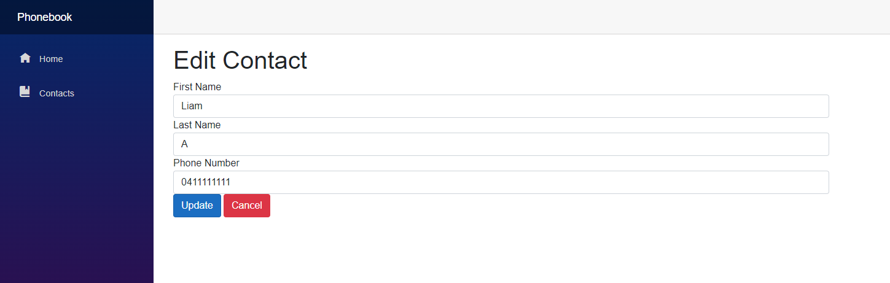
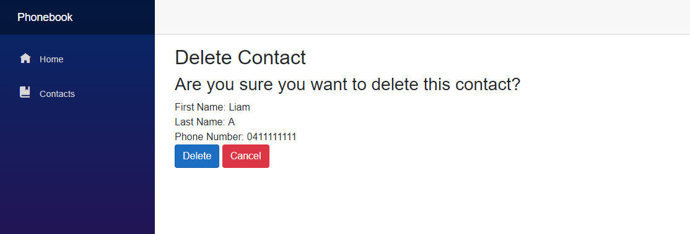

# Phonebook-BlazorApp

**Phonebook CRUD Application implemented using C#.**
* User Interface was created using Blazor server templating.
* Database was created using Entity Framework Core and SQL Server.

**Main Menu:**

    

**Add Contact:**

    

**Edit Contact:**

    

**Delete Contact:**

    

